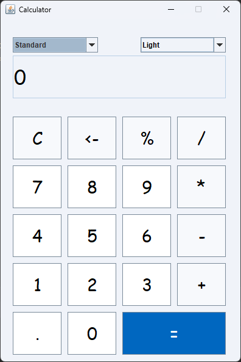

# Calculator 🧮
A very basic calculator application created using Java **Swing**.

## Thank You! 🙌
If you find this project helpful, please ⭐️ this repo and share it with others!

## Screenshots 📸
|                Scientific / Dark Mode                | Standard / Colored Mode |
:-----------------------------------------------------:|:-----------------------:|
 | 

## Requirements 🔧
* Java 11 or higher.

## Installation 🔌
1. Press the **Fork** button (top right of the page) to save a copy of this project to your account.

2. Download the repository files (project) from the download section or clone this project .

3. Import it into IntelliJ IDEA or any other Java IDE.
4. Run the application and enjoy! 😀

## Contributing 💡
If you want to contribute to this project and make it better with new ideas, your pull request is very welcome! If you find any issues, just put them in the repository's issue section. Thank you!

## 🌟 Keep Exploring! 🌟
Thanks a bunch for diving into this project! If you had a blast or learned something new, why not dive into more of my captivating projects and contributions on my profile?

[GitHub](https://github.com/HAFTS11) | [LinkedIn](https://www.linkedin.com/in/hafts11/)

## 💬 Share Your Thoughts! 💡
Your feedback is like treasure to us! Your brilliant ideas and insights fuel our ongoing improvement. Got something to say, ask, or suggest? Don't hold back!

📬 Drop me a line via email: [hali786fts@gmail.com](mailto:hali786fts@gmail.com)

Huge thanks for your time and engagement. Your support is like rocket fuel propelling me to create even more epic content. Keep coding joyfully and wishing you stellar success in your data science adventures! 🚀